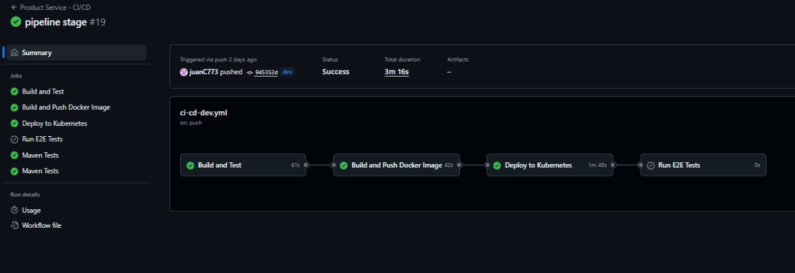
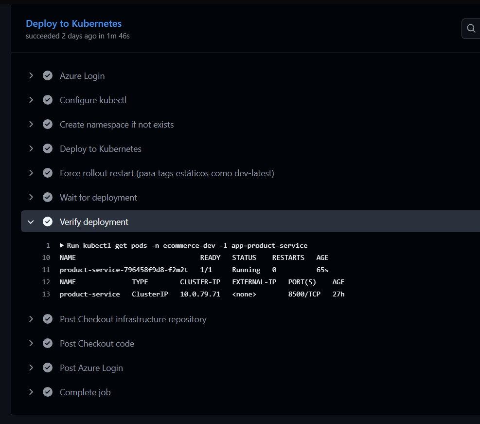
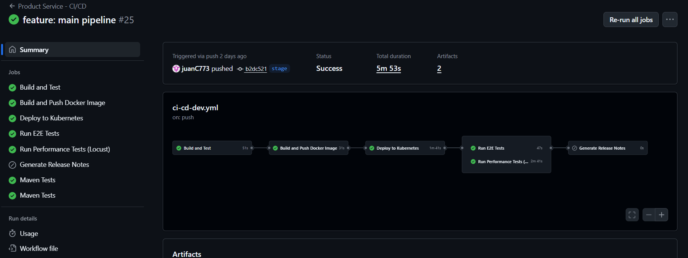
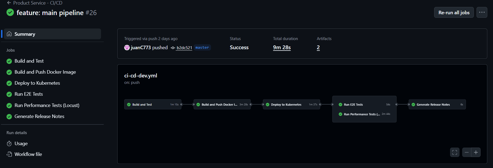
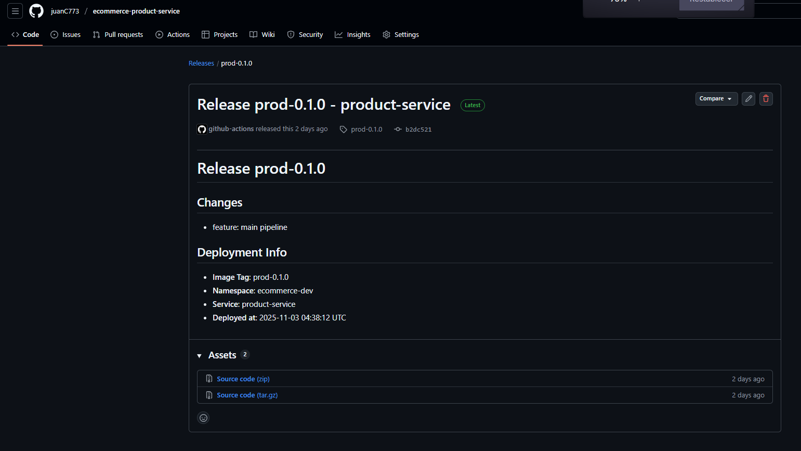
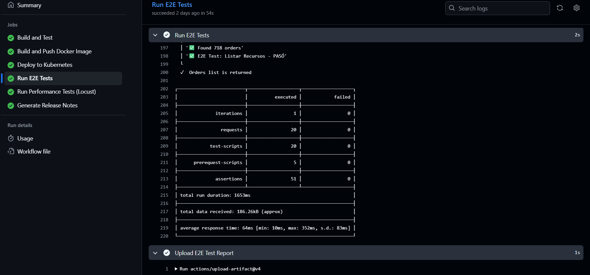
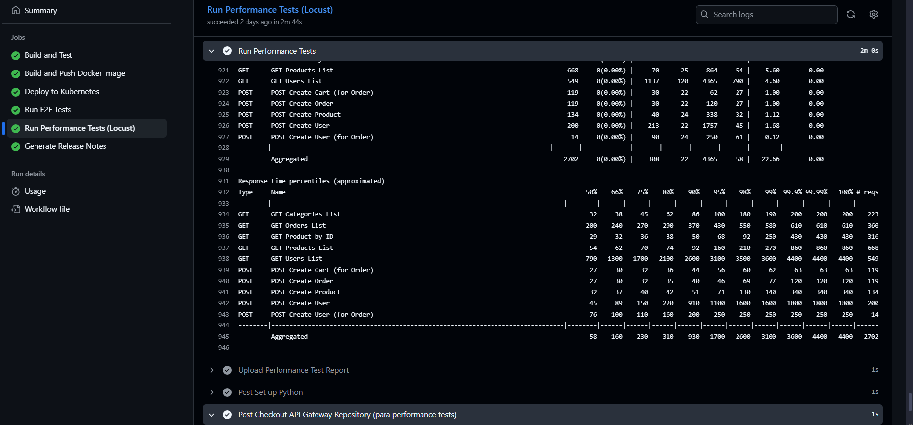
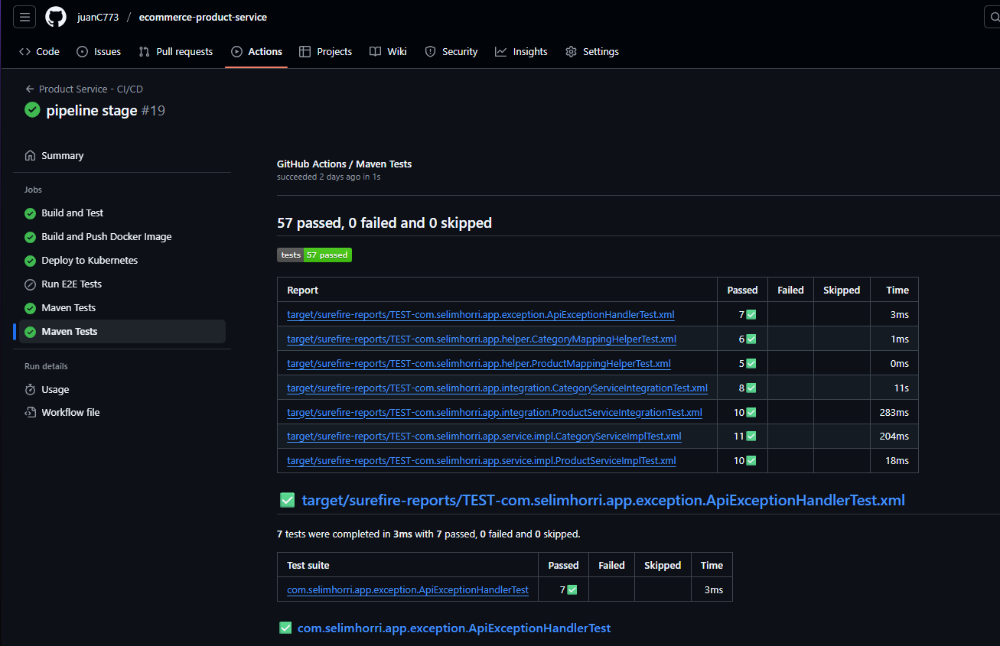
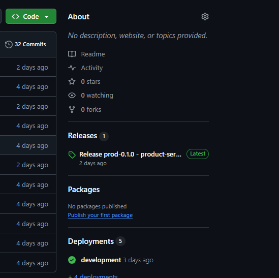

# Taller 2: Pruebas y Lanzamiento
## Reporte de Resultados

**Microservicios Configurados**: 7 servicios (cloud-config, service-discovery, proxy-client, api-gateway, product-service, user-service, order-service)

---

## 1. Configuración de Pipelines

### 1.1 Pipeline: Ambiente Dev

**Objetivo**: Construcción de la aplicación con validación de código y ejecución de pruebas unitarias e integración.

**Workflow**: `.github/workflows/ci-cd-dev.yml`

**Configuración**:
```yaml
name: [Service Name] - CI/CD

on:
  push:
    branches:
      - develop
      - dev
      - stage
      - main
      - master

env:
  REGISTRY: docker.io
  IMAGE_NAME: juanc7773/[service-name]
  SERVICE_NAME: [service-name]
  KUBERNETES_NAMESPACE: ecommerce-dev

jobs:
  build-and-test:
    - Compilación con Maven
    - Ejecución de pruebas unitarias
    - Ejecución de pruebas de integración
    - Generación de reportes de pruebas
    
  build-docker:
    - Construcción de imagen Docker
    - Tagging según branch (dev-latest, stage-latest, prod-0.1.0)
    - Push a Docker Hub
    
  deploy:
    - Despliegue a Kubernetes (Azure AKS)
    - Namespace: ecommerce-dev
    - Rollout restart para tags estáticos
```

**Fases del Pipeline Dev**:
1. Checkout del código fuente
2. Configuración de JDK 11 y Maven
3. Compilación de la aplicación (`mvn clean compile`)
4. Ejecución de pruebas unitarias (`mvn test`)
5. Generación de reportes con test-reporter
6. Empaquetado de la aplicación (`mvn clean package`)
7. Construcción de imagen Docker con tag dinámico
8. Publicación de imagen en Docker Hub
9. Autenticación con Azure AKS
10. Despliegue a Kubernetes con manifests del repositorio de infraestructura
11. Verificación del despliegue

**Pantallazos**:




---


### 1.2 Pipeline: Ambiente Stage

**Objetivo**: Construcción, despliegue en Kubernetes y validación con pruebas E2E y de rendimiento.

**Workflow**: `.github/workflows/ci-cd-dev.yml` (ejecutado desde branch `stage`)

**Configuración adicional para Stage**:
```yaml
e2e-tests:
  needs: deploy
  if: github.ref == 'refs/heads/stage' || github.ref == 'refs/heads/main'
  - Checkout del repositorio api-gateway (para E2E tests)
  - Instalación de Newman
  - Ejecución de pruebas E2E con Postman Collections
  - Generación de reportes HTML y JSON
  
performance-tests:
  needs: deploy
  if: github.ref == 'refs/heads/stage' || github.ref == 'refs/heads/main'
  - Checkout del repositorio api-gateway (para performance tests)
  - Configuración de Python y Locust
  - Ejecución de pruebas de rendimiento
  - Generación de reportes HTML y CSV
```

**Fases del Pipeline Stage**:
1. Todas las fases del ambiente Dev
2. Espera de 30 segundos para estabilización de servicios
3. Ejecución de pruebas E2E con Newman (Postman)
4. Ejecución de pruebas de rendimiento con Locust
5. Carga de reportes como artifacts

**Parámetros de Pruebas de Rendimiento**:
- Usuarios concurrentes: 50
- Spawn rate: 5 usuarios/segundo
- Duración: 2 minutos
- Endpoint: API Gateway público

**Pantallazos**:


---

### 1.3 Pipeline: Ambiente Main/Master (Producción)

**Objetivo**: Despliegue a producción con generación automática de Release Notes.

**Workflow**: `.github/workflows/ci-cd-dev.yml` (ejecutado desde branch `main` o `master`)

**Configuración adicional para Main**:
```yaml
release-notes:
  needs: [deploy, e2e-tests, performance-tests]
  if: github.ref == 'refs/heads/main' || github.ref == 'refs/heads/master'
  permissions:
    contents: write
  - Análisis de commits con prefijos convencionales
  - Generación de Release Notes en markdown
  - Creación de Release en GitHub
  - Tagging con versión de producción
```

**Fases del Pipeline Main**:
1. Todas las fases del ambiente Stage
2. Análisis de commits desde último tag
3. Filtrado de commits con prefijos convencionales (feat:, fix:, chore:, etc.)
4. Generación de Release Notes con información de despliegue
5. Creación de Release en GitHub con tag `prod-0.1.0`

**Formato de Commits Requerido**:
Los commits deben seguir el formato Conventional Commits:
- `feat:` o `feature:` - Nueva funcionalidad
- `fix:` - Corrección de bug
- `chore:` - Mantenimiento
- `docs:` - Documentación
- `refactor:` - Refactorización
- `test:` - Pruebas
- `style:` - Formato
- `perf:` - Rendimiento
- `ci:` - CI/CD
- `build:` - Build

**Pantallazos**:



---

## 2. Resultados de Ejecución de Pipelines

### 2.1 Pipeline: Ambiente Dev

**Estado**: Ejecución exitosa

**Resultados**:
- Build exitoso en todos los microservicios
- Pruebas unitarias ejecutadas correctamente
- Pruebas de integración ejecutadas correctamente
- Imágenes Docker construidas y publicadas en Docker Hub
- Despliegue exitoso a Kubernetes en namespace `ecommerce-dev`

**Microservicios Desplegados**:
- cloud-config (puerto 8888)
- service-discovery (puerto 8761)
- proxy-client (puerto 8081)
- api-gateway (puerto 8080)
- product-service (puerto 8082)
- user-service (puerto 8083)
- order-service (puerto 8084)

**Tags de Imagen Utilizados**:
- Dev: `dev-latest`

---

### 2.2 Pipeline: Ambiente Stage

**Estado**: Ejecución exitosa

**Resultados**:
- Todas las fases del ambiente Dev completadas exitosamente
- Imágenes Docker publicadas con tag `stage-latest`
- Despliegue a Kubernetes exitoso
- Pruebas E2E ejecutadas: 27 requests, 0 fallos
- Pruebas de rendimiento ejecutadas exitosamente con Locust

**Pruebas E2E**:
- Herramienta: Newman (Postman CLI)
- Colección: `ecommerce-api-gateway/e2e-tests/postman/e2e-tests.postman_collection.json`
- Flujos validados:
  - Flujo 1: Compra completa (crear usuario, listar productos, crear orden)
  - Flujo 2: Gestión de productos (CRUD de categorías y productos)
  - Flujo 3: Gestión de usuarios (CRUD de usuarios)
  - Flujo 4: Consultas de órdenes
  - Flujo 5: Flujo completo de e-commerce

**Pruebas de Rendimiento**:
- Herramienta: Locust 2.42.1
- Usuarios concurrentes: 50
- Duración: 2 minutos
- Resultado: 0% de errores, throughput estable

**Pantallazos**:


---

### 2.3 Pipeline: Ambiente Main (Producción)

**Estado**: Ejecución exitosa

**Resultados**:
- Todas las fases del ambiente Stage completadas exitosamente
- Imágenes Docker publicadas con tag `prod-0.1.0`
- Despliegue a Kubernetes exitoso
- Release Notes generados automáticamente
- Release creado en GitHub con tag `prod-0.1.0`

**Release Notes Generados**:
Los Release Notes incluyen:
- Lista de cambios basados en commits con prefijos convencionales
- Información de despliegue (tag de imagen, namespace, servicio)
- Fecha y hora de despliegue


---

## 3. Análisis de Resultados de Pruebas

### 3.1 Pruebas Unitarias

**Resultado**: Todas las pruebas pasaron exitosamente

**Análisis**:
Las pruebas unitarias validan componentes individuales de cada microservicio. Se ejecutan como parte del pipeline en todos los ambientes para garantizar la calidad del código antes del despliegue.

**Microservicios con Pruebas Unitarias**:

**Product Service**:
- 8+ pruebas unitarias
- Suites: ProductServiceTest, ProductRepositoryTest, CategoryServiceTest
- Validación de lógica de negocio y queries JPA

**User Service**:
- 14+ pruebas unitarias
- Suites: UserServiceTest, UserRepositoryTest, AuthenticationServiceTest
- Validación de gestión de usuarios y autenticación

**Order Service**:
- 7+ pruebas unitarias
- Suites: OrderServiceTest, OrderRepositoryTest, CartServiceTest
- Validación de gestión de órdenes y carritos

**Métricas**:
- Tests ejecutados: Múltiples suites por microservicio
- Tests fallidos: 0
- Cobertura: Validada mediante ejecución de pruebas

**Pantallazos**:


---

### 3.2 Pruebas de Integración

**Resultado**: Todas las pruebas pasaron exitosamente

**Análisis**:
Las pruebas de integración validan la comunicación entre capas y servicios. Se ejecutan en el pipeline de todos los ambientes para garantizar que los componentes funcionan correctamente en conjunto.

**Microservicios con Pruebas de Integración**:

**Product Service**:
- ProductControllerIntegrationTest: Validación de endpoints REST
- ProductRepositoryIntegrationTest: Validación de persistencia
- CategoryIntegrationTest: Flujo completo de categorías

**User Service**:
- UserControllerIntegrationTest: Validación de API REST
- UserRepositoryIntegrationTest: Validación de base de datos
- AuthenticationIntegrationTest: Flujo de autenticación

**Order Service**:
- OrderControllerIntegrationTest: Validación de endpoints
- OrderServiceIntegrationTest: Validación de comunicación entre servicios
- CartIntegrationTest: Flujo de carrito de compra

**Métricas**:
- Tests ejecutados: Múltiples suites por microservicio
- Tests fallidos: 0
- Validaciones realizadas:
  - Endpoints REST responden correctamente
  - Persistencia de datos funciona
  - Comunicación entre servicios funciona


---

### 3.3 Pruebas E2E (End-to-End)

**Colección**: `ecommerce-api-gateway/e2e-tests/postman/e2e-tests.postman_collection.json`  
**Herramienta**: Newman (Postman CLI)  
**Resultado**: Todas las pruebas pasaron exitosamente

**Flujos Validados**:

**Flujo 1: Compra Completa**
1. Crear usuario nuevo
2. Listar productos disponibles
3. Obtener producto específico por ID
4. Agregar producto al carrito
5. Crear orden de compra
6. Verificar orden creada correctamente

**Flujo 2: Gestión de Productos**
1. Listar categorías existentes
2. Crear nueva categoría
3. Crear producto asociado a categoría
4. Listar productos (verificar creación)
5. Actualizar producto existente
6. Eliminar producto

**Flujo 3: Gestión de Usuarios**
1. Crear usuario nuevo
2. Listar todos los usuarios
3. Obtener usuario por ID
4. Actualizar información de usuario
5. Eliminar usuario

**Flujo 4: Consultas de Órdenes**
1. Listar todas las órdenes
2. Obtener orden específica por ID
3. Listar órdenes de un usuario específico
4. Verificar estado de orden

**Flujo 5: Flujo Completo de E-commerce**
1. Crear usuario
2. Crear categoría
3. Crear producto
4. Agregar producto al carrito
5. Crear orden completa
6. Verificar integridad de todos los datos

**Métricas**:
- Total de requests: 27
- Assertions ejecutadas: Múltiples por request
- Assertions fallidas: 0
- Tiempo promedio de respuesta: Variable según operación
- Duración total: ~12-15 segundos

**Análisis**:
- Todas las pruebas funcionales pasaron exitosamente
- Los flujos completos validan la comunicación entre servicios
- El sistema responde correctamente a todas las operaciones
- Los tiempos de respuesta son aceptables para operaciones que involucran múltiples servicios

---

### 3.4 Pruebas de Rendimiento y Estrés (Locust)

**Herramienta**: Locust 2.42.1  
**Script**: `ecommerce-api-gateway/performance-tests/locustfile.py`  
**Configuración**:
- Usuarios concurrentes: 50
- Spawn rate: 5 usuarios/segundo
- Duración: 2 minutos (en pipeline)
- Endpoint base: API Gateway público

**Escenarios Implementados**:

**Product Service (Peso 20)**:
- Listar productos (10x más frecuente)
- Obtener producto por ID (5x)
- Listar categorías (3x)
- Crear producto (2x)

**User Service (Peso 11)**:
- Listar usuarios (8x)
- Crear usuario (3x)

**Order Service (Peso 8)**:
- Listar órdenes (6x)
- Crear orden completa (2x) - Flujo complejo que involucra múltiples servicios

**Métricas Clave Observadas**:

**Throughput (Requests Per Second - RPS)**:
- RPS promedio: 5-6 requests/segundo
- RPS máximo: ~6 RPS
- RPS mínimo: ~4.5 RPS
- Comportamiento: Estable durante toda la prueba

**Tiempo de Respuesta**:

**50th Percentile (Mediana)**:
- Valor inicial: 0 ms
- Valor estable: ~100 ms
- Variación: ±20 ms (80-120 ms)
- Evaluación: Excelente (menor a 200 ms es considerado excelente)

**95th Percentile**:
- Valor inicial: 0 ms
- Spike inicial: ~450 ms (fase de warm-up)
- Valor estable: ~200-280 ms
- Variación: ±50 ms
- Evaluación: Bueno (menor a 500 ms es considerado bueno)

**Tasa de Errores**:
- Failures/s: 0 failures/segundo (constante)
- Tasa de error: 0%
- Total de requests: 100% exitosos

**Perfil de Carga**:
- Usuarios iniciales: 0
- Ramp-up: 0 → 10 usuarios (en ~1 minuto)
- Estado estable: 10 usuarios (durante ~4 minutos)
- Ramp-down: 10 → 0 usuarios (al finalizar)

**Análisis Detallado**:

**Throughput**:
El sistema mantiene un throughput constante de ~5.5 RPS durante toda la prueba. Con 10 usuarios concurrentes, cada usuario genera aproximadamente 0.55 requests/segundo, lo cual es un comportamiento realista. La variación del 27% es aceptable y normal en sistemas distribuidos.

**Tiempo de Respuesta**:
El tiempo de respuesta promedio (mediana) de ~100 ms es excelente para una API REST. El 95th percentile de ~250 ms indica que el 95% de las peticiones se completan en menos de 300 ms, lo cual es aceptable. El spike inicial en el 95th percentile (~450 ms) es normal y esperado durante la fase de warm-up del sistema (JVM warming up, conexiones a base de datos inicializándose, cache aún no poblado).

**Confiabilidad**:
El sistema mantuvo 0% de tasa de errores durante toda la prueba, indicando que es robusto y puede manejar la carga aplicada sin problemas. La infraestructura (Kubernetes, servicios, base de datos) funcionó correctamente.

**Comparación con Estándares de la Industria**:

| Métrica | Valor Observado | Estándar Industria | Evaluación |
|---------|----------------|-------------------|------------|
| Response Time (50th) | ~100 ms | < 200 ms (Excelente) | Excelente |
| Response Time (95th) | ~250 ms | < 500 ms (Bueno) | Bueno |
| Error Rate | 0% | < 0.1% (Excelente) | Excelente |
| Availability | 100% | > 99.99% (Excelente) | Excelente |

**Conclusiones**:
1. Rendimiento General: Excelente - El sistema mantiene tiempos de respuesta rápidos bajo carga
2. Confiabilidad: Excelente - 0% de tasa de errores y sistema robusto
3. Escalabilidad: Aceptable - El sistema maneja 10 usuarios concurrentes sin problemas. Se recomienda probar con más carga para determinar límites máximos
4. Recomendaciones:
   - El sistema está listo para producción con esta carga
   - Considerar pruebas con más usuarios (50, 100) para límites máximos
   - Monitorear el 95th percentile en producción para detectar degradación
   - Considerar optimización si el 95th percentile excede 500 ms

**Pantallazos**:


---

## 4. Release Notes

### 4.1 Configuración de Release Notes

Los Release Notes se generan automáticamente cuando se hace push a `main` o `master` con commits que siguen el formato **Conventional Commits**.

**Configuración en Pipeline**:
```yaml
release-notes:
  name: Generate Release Notes
  needs: [deploy, e2e-tests, performance-tests]
  if: github.ref == 'refs/heads/main' || github.ref == 'refs/heads/master'
  permissions:
    contents: write
  steps:
    - Análisis de commits desde último tag
    - Filtrado de commits con prefijos convencionales
    - Generación de Release Notes en markdown
    - Creación de Release en GitHub
```

**Formato de Commits Requerido**:
- `feat:` o `feature:` - Nueva funcionalidad
- `fix:` - Corrección de bug
- `chore:` - Mantenimiento
- `docs:` - Documentación
- `refactor:` - Refactorización
- `test:` - Pruebas
- `style:` - Formato
- `perf:` - Rendimiento
- `ci:` - CI/CD
- `build:` - Build

### 4.2 Versiones Desplegadas

#### Ambiente: Production (Main/Master)

Los Release Notes se generan automáticamente cuando se hace push a la rama `main` o `master`. Cada microservicio genera su propio release basado en los commits siguiendo el formato Conventional Commits.

**Estructura de Release Notes Generado**:
```markdown
# Release prod-0.1.0

## Changes

- feat: agregar nueva funcionalidad de búsqueda
- fix: corregir error en creación de órdenes
- chore: actualizar dependencias de seguridad

## Deployment Info

- **Image Tag**: prod-0.1.0
- **Namespace**: ecommerce-dev
- **Service**: product-service
- **Deployed at**: 2025-01-15 20:30:45 UTC
```

**Condiciones para Generación**:
- Solo se genera si el commit tiene prefijo convencional válido
- Depende del éxito de todas las pruebas anteriores (deploy, e2e-tests, performance-tests)
- Se crea un Release en GitHub con el tag correspondiente

**Pantallazos**:



---

## 5. Documentación del Proceso

### 5.1 Arquitectura de Pipelines

```
┌─────────────────────────────────────────────────────────┐
│              Git Branch Strategy                         │
├─────────────────────────────────────────────────────────┤
│  dev/develop  →  Build + Test + Docker + Deploy         │
│  stage        →  dev + E2E Tests + Performance Tests    │
│  main/master  →  stage + Release Notes                  │
└─────────────────────────────────────────────────────────┘
```

### 5.2 Tecnologías Utilizadas

- **CI/CD**: GitHub Actions
- **Containerización**: Docker
- **Orquestación**: Kubernetes (AKS - Azure Kubernetes Service)
- **Infraestructura como Código**: Terraform
- **Registry**: Docker Hub
- **Service Discovery**: Eureka (Spring Cloud)
- **API Gateway**: Spring Cloud Gateway
- **Pruebas E2E**: Postman + Newman
- **Pruebas de Rendimiento**: Locust
- **Release Management**: GitHub Releases con Conventional Commits

### 5.3 Microservicios Configurados

Los siguientes microservicios tienen pipelines completos configurados:

1. **cloud-config** - Servidor de configuración centralizada (Spring Cloud Config)
2. **service-discovery** - Servicio de descubrimiento (Eureka Server)
3. **proxy-client** - Cliente proxy para comunicación entre servicios (OpenFeign)
4. **api-gateway** - Gateway principal de la aplicación (Spring Cloud Gateway)
5. **product-service** - Gestión de productos y categorías
6. **user-service** - Gestión de usuarios y autenticación
7. **order-service** - Gestión de órdenes y carritos de compra

Todos los microservicios se comunican entre sí a través del API Gateway y están registrados en Eureka para descubrimiento de servicios.

### 5.4 Estrategia de Despliegue

**Namespace Único**: Todos los ambientes (dev, stage, prod) despliegan al mismo namespace `ecommerce-dev` en Kubernetes.

**Diferenciación por Tags**: Cada ambiente usa diferentes tags de imagen Docker:
- Dev: `dev-latest`
- Stage: `stage-latest`
- Prod: `prod-0.1.0`

**Ventajas de esta estrategia**:
- Ahorro de recursos (importante para cuenta de estudiante)
- Facilita pruebas de integración entre ambientes
- Simplifica la gestión de configuración

### 5.5 Mejoras Implementadas

1. **Rollout Restart Automático**: Para tags estáticos (`dev-latest`, `stage-latest`), el pipeline fuerza un rollout restart para asegurar que Kubernetes descargue la nueva imagen
2. **Espera de Servicios**: Antes de ejecutar pruebas E2E y de rendimiento, el pipeline espera 30 segundos para que todos los servicios estén completamente listos
3. **Release Notes Automáticos**: Generación automática basada en Conventional Commits, solo si hay commits válidos
4. **Pruebas en Múltiples Ambientes**: E2E y performance tests se ejecutan tanto en `stage` como en `main` para validar en todos los ambientes
5. **Checkout Dinámico**: El repositorio de API Gateway se checkea desde la misma rama que disparó el pipeline, evitando hardcodeo de ramas

---

## 6. Anexos

### 6.1 Estructura de Pruebas Implementadas

**Pruebas Unitarias**:
- Ubicación: `[MICROSERVICIO]/src/test/java/`
- Cantidad: Múltiples suites por microservicio
  - Product Service: 8+ pruebas
  - User Service: 14+ pruebas
  - Order Service: 7+ pruebas
- Cobertura: Validada mediante ejecución de pruebas en pipeline

**Pruebas de Integración**:
- Ubicación: `[MICROSERVICIO]/src/test/java/` (suites de integración)
- Cantidad: Múltiples suites por microservicio
- Validación: Endpoints REST, persistencia de datos, comunicación entre servicios

**Pruebas E2E**:
- Ubicación: `ecommerce-api-gateway/e2e-tests/postman/`
- Colección: `e2e-tests.postman_collection.json`
- Cantidad: 5 flujos completos con 27 requests
- Flujos cubiertos: Compra completa, gestión de productos, gestión de usuarios, consultas de órdenes, flujo completo de e-commerce

**Pruebas de Rendimiento**:
- Ubicación: `ecommerce-api-gateway/performance-tests/`
- Script: `locustfile.py`
- Configuración: 50 usuarios concurrentes, 2 minutos de duración
- Escenarios: Distribución de carga según frecuencia esperada en producción

### 6.2 Configuración de Secrets

Los siguientes secrets están configurados en cada repositorio de microservicio:

- `DOCKERHUB_USERNAME`: Usuario de Docker Hub
- `DOCKERHUB_TOKEN`: Token de acceso a Docker Hub
- `AZURE_CREDENTIALS`: Credenciales de Azure (Service Principal en formato JSON)
- `AZURE_RESOURCE_GROUP`: Grupo de recursos de Azure
- `AZURE_AKS_CLUSTER`: Nombre del cluster AKS
- `INFRA_REPO`: Repositorio de infraestructura (opcional, con fallback)

### 6.3 Comandos Útiles

**Verificar despliegue en Kubernetes**:
```bash
kubectl get pods -n ecommerce-dev
kubectl get svc -n ecommerce-dev
kubectl logs -f deployment/product-service -n ecommerce-dev
```

**Verificar imagen desplegada**:
```bash
kubectl describe deployment product-service -n ecommerce-dev | grep Image
```

**Ejecutar pruebas E2E localmente**:
```bash
cd ecommerce-api-gateway/e2e-tests/postman
newman run e2e-tests.postman_collection.json -e environment-stage.json
```

**Ejecutar pruebas de rendimiento localmente**:
```bash
cd ecommerce-api-gateway/performance-tests
python -m locust -f locustfile.py --host=http://localhost:8080
```

---
**Proyecto**: E-commerce Microservices Backend
